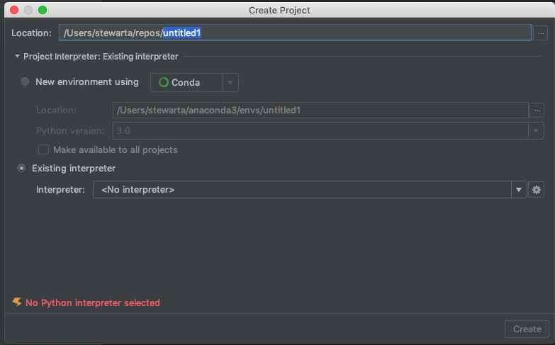
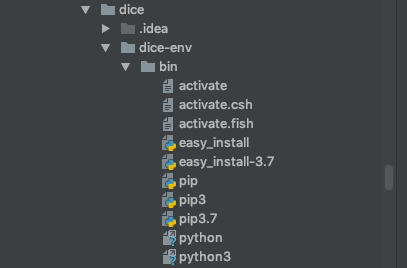
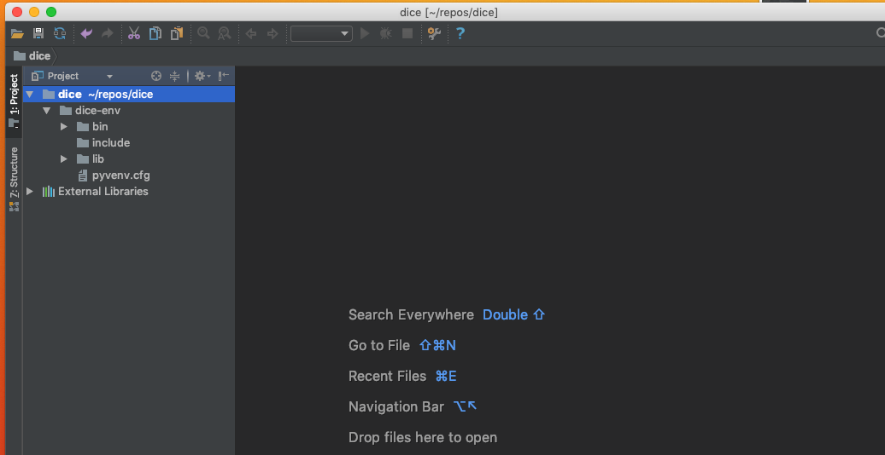
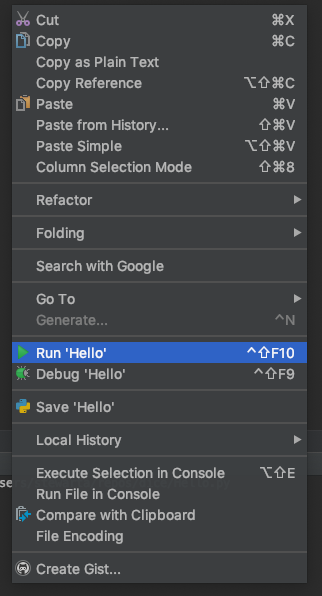

# first-steps

## Create a Python Virtual Environment: 

a virtual environment a tool that helps to keep dependencies required by different projects
separate by creating isolated python code for each of the projects. If you are new to creating Python 
virtual environments, refer to the instructions in 
[Creating a Virtual Environment with Python](https://github.com/pyladieshamburg/getting-started-with-python#create-a-virtual-environment-with-python-3)
  

## Create a Working Directory for Your Code

* Create a directory named "dice" where your code and enviroment with will placed. 

    `mkdir dice`
    
* Change into the "dice" directory:

    `cd dice`

* Create a Python virtual environment

    `python3 -m venv dice-env`

* Activate the newly created virtual environment

    `source dice-env/bin/activate`

##  Install PyCharm Integrated Development Environment (IDE)

An IDE is a software suite that consolidates basic tools required to write and test software. We will use PyCharm Community Edition.

* [Download PyCharm](https://www.jetbrains.com/pycharm/)

* Following the installation instruction for your operating system

## Setting up Your First PyCharm Project with a Python Virtual Environment

* Launch PyCharm

* Select "Create New Project"

* Locate the "..." symbol. It is on  the __far right, top corner__

* Select working directory name : 'dice'

* Select "Create Project"

## Choose an Interpreter 

Choosing which interpreter to use for a project is an important decision. 
Python is a script language, which means that your code is converted to machine code by a Python interpreter.
You can have multiple versions of Python installed on your computer, and you need to choose the one you’d like for this project.

* Choose the interpreter that is in the dice-env folder:

### Steps for Choosing the dice-env Interpreter

Then, follow these steps:

* Click triangle : next to : Project Interpreter: Existing interpreter`
* Selectradio button `Existing interpreter` 
* Select wheel icon
* Select `Add local`
* Select `Virtualenv Environment`
* Select symbol `...`
* find folder : "dice/dice-env/bin/python3"
* Select `OK` : to accept the folder
* Select `OK` : again, to add local
* Select `Create` : to create the project
* Select `Yes at the following prompt:  `Create Project : The is not empty. Would you like to create a project from existing sources instead?`

## Running  Your First Python Project

* Create a new Python file 

+ Check out this link to [creat and run your first python project](https://www.jetbrains.com/help/pycharm/creating-and-running-your-first-python-project.html#create-file)

## Python Syntax : Enough to Get Started

[Python Syntax](https://www.w3schools.com/python/python_syntax.asp)

[Python Code Layout:](https://www.python.org/dev/peps/pep-0008/#id16)

* Enter this python code into the file:

`print("Hello World: My Nane is <YOUR NAME HERE> ")`

## Run Hello World

# Project : Roll the Dice  

Generate random numbers for various distributions including integer and floats.
Random Sampling and choose elements from the population.
Functions of the random module.
Shuffle the sequence data. Seed the random generator.
Generate random strings and password.
Cryptographically secure random generator using secrets module. Generate secure tokens, security keys, and URL
How to set the state of a random generator.
Use numpy.random to generate random arrays.
Use the UUID module to generate unique IDs

Roll Single Dice

## import package
## print
## Random Number Generator:

https://pythonspot.com/random-numbers/
https://docs.python.org/3/library/random.html

## Learn More:  Roll Two Die

Use For loop to generate several random numbers

https://www.pythoncentral.io/how-to-generate-a-random-number-in-python/

## Learn Even More About Random :

https://pynative.com/python-random-module/

Take a Quiz: https://pynative.com/python-random-data-generation-quiz/

# Feedback : What topics do you want to learn in an upcoming Session in the Essential Python 
Series ..... enter here

dice

Survey

https://forms.gle/Jaia5D3qWh319Xod6

<iframe src="https://docs.google.com/forms/d/e/1FAIpQLSeE8xSI3oS5TDTnnvUKaRziZ-KJtNeJnsHpl4CqeXmuUbxT1g/viewform?embedded=true" width="640" height="500" frameborder="0" marginheight="0" marginwidth="0">Loading...</iframe>